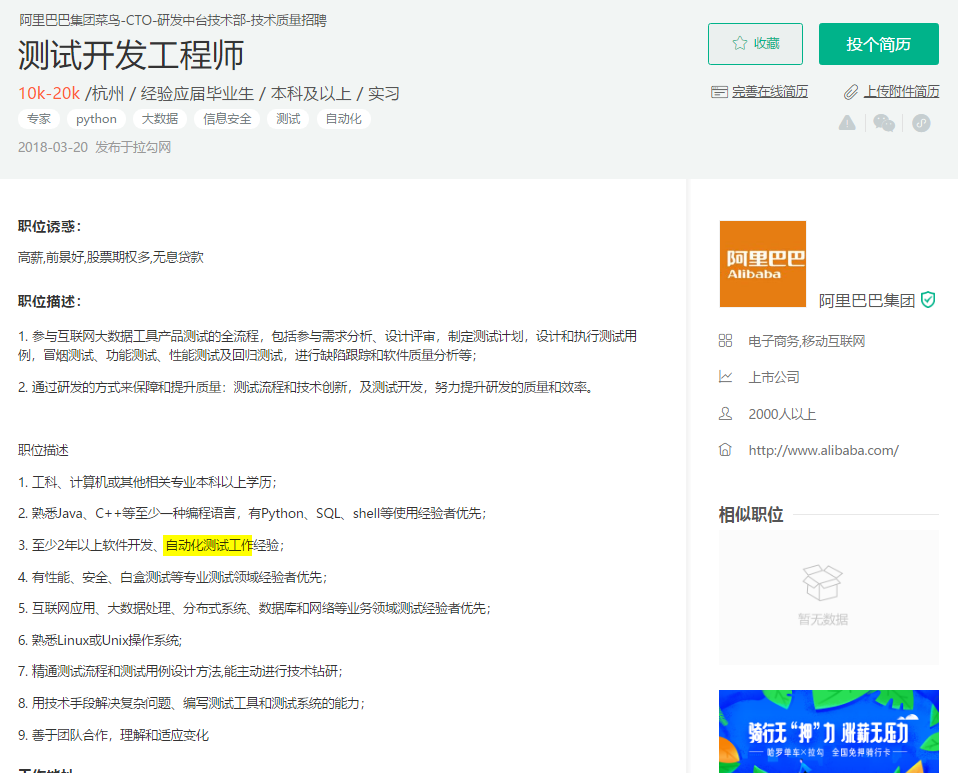
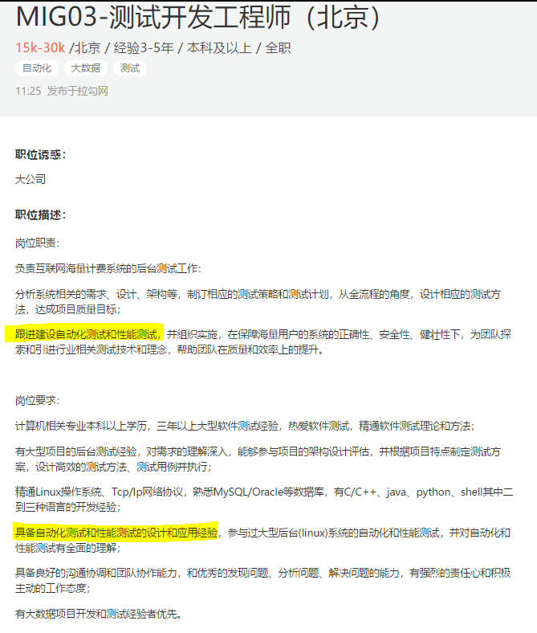
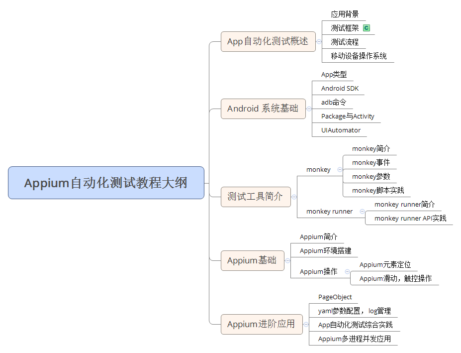
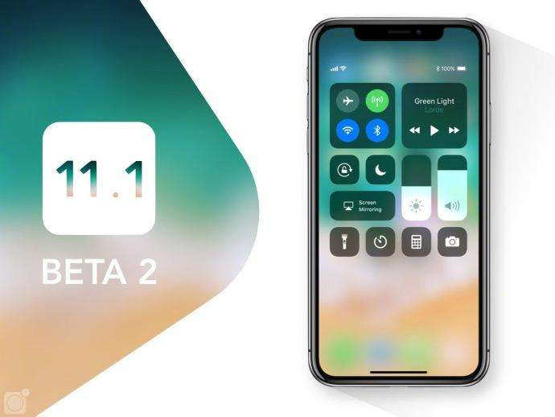
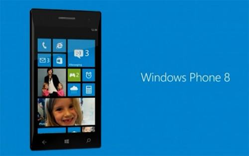
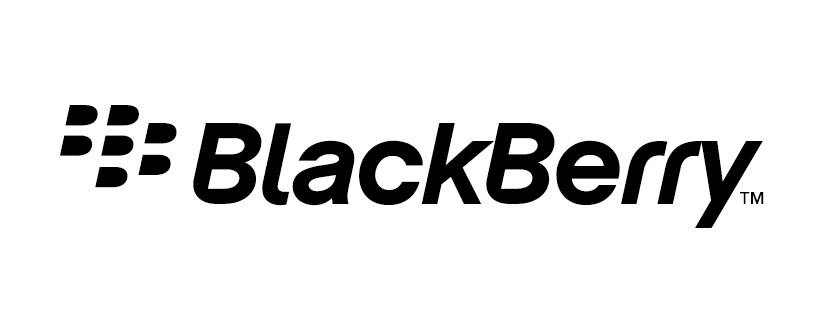
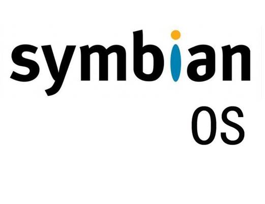
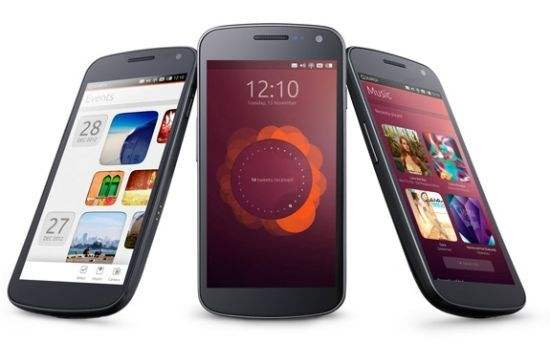
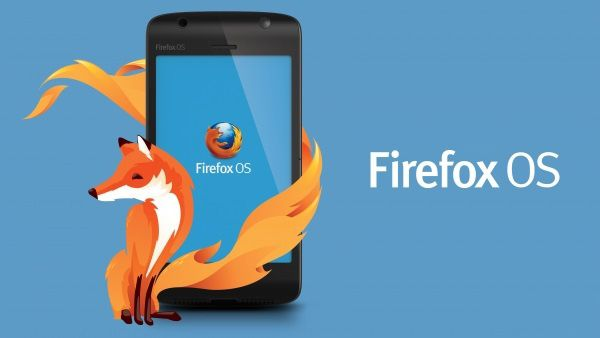
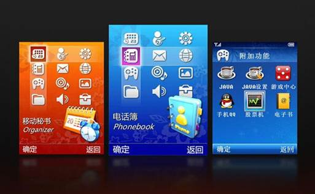

Appium自动化测试课程简介
========================

课程背景
--------

随着移动互联网和智能设备越来越普及，移动App已经渗透到了我们的生活方方面面，比如出行、饮食、旅行、社交、金融等。

用户对App产品的质量和用户体验要求越来越高。因此很多互联网企业也因此开始对移动端产品质量越来越重视。但是App产品不断迭代更新，给测试人员也增加了测试工作量，特别是大量繁琐的回归测试。

自动化测试是应对产品不断迭代更新的辅助测试手段（主要是针对回归测试），最终目的是为了保证产品质量。

###### BAT拉钩网招聘需求

### 阿里

{width="6.106907261592301in"
height="4.930343394575678in"}

### 百度

{width="5.869293525809274in"
height="4.059830489938758in"}

### 腾讯

{width="4.914145888013998in"
height="5.791637139107611in"}

课程内容与目标
--------------

##### 课程内容

-   App自动化测试概述

-   Android 系统基础

-   Android自动化测试工具应用

-   **Appium实践应用**（本套课程重点）

-   App自动化综合实战

具体学习内容见课程大纲

##### 课程目标

-   掌握自动化测试流程、制定自动化测试方案

-   独立完成App自动化脚本编写与运行

-   掌握Appium、adb、moneky等测试工具

-   熟悉自动化测试框架搭建

移动端App自动化该如何去学习？
-----------------------------

-   掌握基础编码技能（[[Python]{.underline}](http://www.51zxw.net/list.aspx?cid=615)，java），测试思路理论、自动化测试工具

-   多看自学网技术教程（网页在线和[[App]{.underline}](http://www.51zxw.net/zt/aboutapp/downapp.html)离线观看两不误）

-   学习过程中务必请"除四害"：（微信、淘宝、小视频、游戏）

-   欢迎在视频下方留言打卡学习

> {width="7.503945756780403in"
> height="5.739583333333333in"}

**移动设备操作系统兴亡简史**

移动设备操作系统名单
====================

#### 主流

-   Andriod

-   iOS

#### 非主流

-   Winphone

-   黑莓

-   塞班

-   ubuntu

-   Asha

-   Tizen

-   Jolla

-   Firefox OS

#### 非智能机

-   MTK平台

-   S40平台

操作系统简介
------------

#### Andriod

Android是一种基于Linux的自由及开放源代码的操作系统，主要使用于移动设备，如智能手机和平板电脑，由Google公司和开放手机联盟领导及开发。

{width="6.077959317585302in"
height="3.8001115485564303in"}

#### iOS

iOS是由苹果公司开发的移动操作系统
。苹果公司最早于2007年1月9日的Macworld大会上公布这个系统，最初是设计给iPhone使用的，后来陆续套用到iPod
touch、iPad以及Apple TV等产品上。iOS与苹果的Mac OS
X操作系统一样，属于类Unix的商业操作系统。

{width="4.61705927384077in"
height="3.4671412948381453in"}

小调查：你目前使用的什么手机操作系统？

-   Android回复留言1，

-   iOS回复留言2；

-   Android和iOS同时在使用留言回复3，

-   其他系统回复留言4，并备注系统名称。

**Tips**：不管你是Android还是iOS都可以下载安装自学网官方App。[[下载地址页面]{.underline}](http://www.51zxw.net/zt/aboutapp/downapp.html)

#### Windows Phone

Windows
Phone(简称为WP)是微软于2010年10月21日正式发布的一款手机操作系统，初始版本命名为Windows
Phone 7.0 \[1\] 。基于Windows
CE内核，采用了一种称为Metro的用户界面(UI)，并将微软旗下的Xbox
Live游戏、Xbox
Music音乐与独特的视频体验集成至手机中。2011年2月，诺基亚与微软达成全球战略同盟并深度合作共同研发该系统。

{width="5.209027777777778in"
height="3.261111111111111in"}

微软宣称将在2017年7月11日正式结束Windows Phone
8.1的服务支持，今后也不会再有对于系统的更新修复和新特性加入。

补充阅读：[[霸主微软，现在还好吗？]{.underline}](http://www.zealer.com/post/3263)

#### 黑莓

BlackBerry OS是Research In
Motion（加拿大的一家通信公司，主要产品为黑莓手机。为其智能手机产品BlackBerry开发的专用操作系统。该系统具有多任务处理能力，并支持特定输入装置，如滚轮、轨迹球、触摸板及触摸屏等。

黑莓已经没落是不不争的事实，但这并不能掩盖它曾经的辉煌。黑莓曾一度引领着手机系统的发展，因此黑莓系统是除了主流手机操作系统的一个不错选择!要知道，美国总统奥巴马曾经用的就是黑莓系统哦。

{width="6.069867672790902in"
height="2.416806649168854in"}

扩展阅读：[[「科技相对论」我的黑莓记忆]{.underline}](http://www.zealer.com/post/1984)

#### 塞班

Symbian系统是塞班公司为手机而设计的操作系统。

2008年12月2日，塞班公司被诺基亚收购。

2011年12月21日，诺基亚官方宣布放弃塞班（Symbian）品牌。由于缺乏新技术支持，塞班的市场份额日益萎缩。截止至2012年2月，塞班系统的全球市场占有量仅为3%。

2012年5月27日，诺基亚彻底放弃开发塞班系统，但是服务将一直持续到2016年。

2013年1月24日晚间，诺基亚宣布，今后将不再发布塞班系统的手机，意味着塞班这个智能手机操作系统，在长达14年的历史之后，终于迎来了谢幕。

2014年1月1日，诺基亚正式停止了Nokia

Store应用商店内对塞班应用的更新，也禁止开发人员发布新应用。
Symbian是一个实时性、多任务的纯32位操作系统，具有功耗低、内存占用少等特点，在有限的内存和运存情况下，非常适合手机等移动设备使用，经过不断完善，可以支持GPRS、蓝牙、SyncML、NFC以及3G技术。

{width="4.34511811023622in"
height="3.341474190726159in"}

#### ubuntu

2013 年 1 月 3 日，Canonical 公司创始人 Mark Shuttleworth 在 Ubuntu
官网宣布，在旗下 Linux 开源操作系统 Ubuntu
桌面版的基础之上，该公司将推出独立的移动操作系统 Ubuntu Touch。

2015 年 2 月，第一款搭载 Ubuntu 系统的智能手机问世。Canonical
公司联合西班牙 BQ 公司推出了一款名为 Aquarius E4.5 的 Ubuntu 手机。

2017 年 4 月 5 日，Mark Shuttleworth 又在官网宣布，Canonical
将停止对手机业务的投资；这就意味着，Ubuntu Touch 寿终正寝了。
　　 {width="5.730555555555555in"
height="3.7909722222222224in"}

#### Firefox OS

是Mozilla公司推出的移动操作系统，它是一款完全开源并免费的移动平台，基于HTML5技术。该系统最大的创新在于HTML5。由于完全遵循HTML5标准，应用开发者将可以使HTML5应用充分发挥设备的硬件性能。

2016年2月5日
Mozilla在发送给开发者的电子邮件当中表示，在2.6版本发布之后，Mozilla将停止开发火狐手机版操作系统。

{width="4.3875in"
height="2.471288276465442in"}

#### MTK平台

MTK是台湾的一个多媒体芯片提供商的简称，全称叫MediatecMediaTek.Inch，MTK方案具备平台价格低，开发周期短，软件成熟，功能整合程度高，功能多价格便宜的优点，缺点是MTK方案的手机基本上功能相似，可玩性不高，生命周期明显比诺基亚等品牌要短。该系统扩展性差，只有少数机型支持扩展，稳定性一般，采用MTK平台多以山寨机闻名，大部分质量很差，使用寿命短。

{width="4.269444444444445in"
height="2.645214348206474in"}

#### 参考资料

1.  [[http://www.pc841.com/shoujizhishi/34449.html]{.underline}](http://www.pc841.com/shoujizhishi/34449.html)

2.  [[http://news.mydrivers.com/1/468/468950.htm]{.underline}](http://news.mydrivers.com/1/468/468950.htm)

3.  [[https://www.linuxidc.com/Linux/2017-04/142567.htm]{.underline}](https://www.linuxidc.com/Linux/2017-04/142567.htm)

移动App自动化测试兵器发展历程
=============================

Android自动化框架
-----------------

工欲善其事必先利其器 ------《论语·卫灵公》

#### 1. Instrumentation

[[https://developer.android.com/reference/android/app/Instrumentation.html]{.underline}](https://developer.android.com/reference/android/app/Instrumentation.html)

Instrumentaion
是Android自带的一个测试框架，是很多其它测试框架的基础，可以在同进程中加载被测组件。它有很多丰富的高层封装，使用者可以使用基于instrumentation的其他框架，避免过多二次开发量。但Instrumentation不支持跨应用,导致基于instrumentation的框架都继承了这个缺点。

#### 2. Robotium

[[https://github.com/robotiumtech/robotium]{.underline}](https://github.com/robotiumtech/robotium)

Robotium是基于Instrumentation框架开发的一个更强的框架.
对常用的操作进行了易用性的封装.
用于开发功能性、系统和验收测试场景。它运行时绑定到GUI组件。它安装了一个测试用例套件作为在Android设备或仿真器上的应用程序，并提供用于执行测试的真实环境。

优点： 容易在最短的时间内编写测试脚本，易用性高。 自动跟随当前activity。
由于运行时绑定到GUI组件，所以相比Appium，它的测试执行更快，更强大。
不访问代码或不了解app实现，也可以工作。
支持Activities、Dialogs、Toasts、Menus、Context Menus和其他Android
SDK控件。

缺点： 不能处理flash和web组件。在旧设备上会变得很慢。
由于不支持iOS设备,当自动化测试同时覆盖
android与iOS的情况时，测试会被中断。
没有内置的记录和回放功能.，使用记录功能需要 TestDroid 和 Robotium
Recorder 这样的收费工具。

#### 3. UIAutomator

[[https://google.github.io/android-testing-support-library/docs/uiautomator/]{.underline}](https://google.github.io/android-testing-support-library/docs/uiautomator/)

UIAutomator是由谷歌提供的测试框架，它提供了原生Android
app和游戏的高级UI测试。这是一个包含API的Java库，用来创建功能性UI测试，还有运行测试的执行引擎。该库自带Android
SDK。

优点：它在运行访问不同的进程时，会给JUnit测试案例特权。库由谷歌社区支持和维护。

缺点：仅支持android 4.1（API level 16）及以上。 不支持脚本记录。
支持的重点是Java。 你不能获得当前活动或仪表化。 目前不支持web视图。
库仅支持使用Java，因此很难和使用Ruby的cucumber混合。如想支持BDD框架，建议使用Java自己的BDD框架，例如Jbehave。

#### 4. Espresso

[[https://google.github.io/android-testing-support-library/docs/espresso/index.html]{.underline}](https://google.github.io/android-testing-support-library/docs/espresso/index.html)

Espresso是Google的开源自动化测试框架。相对于Robotium和UIAutomator，它的特点是规模更小、更简洁，API更加精确，编写测试代码简单，容易快速上手。因为是基于Instrumentation的，所以不能跨App。

#### 5. Calabash

[[https://github.com/calabash]{.underline}](https://github.com/calabash)

Calabash是一个适用于iOS和Android开发者的跨平台app测试框架，可用来测试屏幕截图、手势和实际功能代码。Calabash开源免费并支持Cucumber语言，Cucumber能让你用自然的英语语言表述app的行为，实现BDD（Behavior
Driven Development，行为驱动开发）。 Cucumber中的所有语句使用Ruby定义。

优点： 有大型社区支持。 列表项 简单，类似英语表述的测试语句
支持在屏幕上的所有动作，如滑动，缩放，旋转，敲击等。
跨平台开发支持（同样的代码在Android和iOS设备中都适用）。

缺点：
测试步骤失败后，将跳过所有的后续步骤，这可能会导致错过更严重的产品问题。测试耗费时间，因为它总是默认先安装app。
需要Calabash框架安装在ios的ipa文件中，
因此测试人员必须要有iOS的app源码。 除了Ruby，对其他语言不友好。

#### 6. Appium

[[http://appium.io/]{.underline}](http://appium.io/)

Appium是一个开源的、跨平台的自动化测试工具，支持IOS、Android和FirefoxOS平台。
通过Appium，开发者无需重新编译app或者做任何调整，就可以测试移动应用，可以使测试代码访问后端API和数据库。它是通过驱动苹果的UIAutomation和Android的UiAutomator框架来实现的双平台支持，同时绑定了Selenium
WebDriver用于老的Android平台测试。开发者可以使用WebDriver兼容的任何语言编写测试脚本，如Java，
OC， JS， PHP，Python， Ruby， C\#，Clojure 和Perl语言。

#### 7. Selendroid

[[https://www.gitbook.com/book/lihuazhang/selendroid/details]{.underline}](https://www.gitbook.com/book/lihuazhang/selendroid/details)

Selendroid 是一个基于Instrumentation的一个框架. 完全兼容Webdriver协议。
Selendroid
可以在模拟器和实际设备上使用，也可以集成网格节点作为缩放和并行测试。

#### 8. Robolectric

[[http://robolectric.org/]{.underline}](http://robolectric.org/)

Robolectric
是一款Android单元测试框架，但它并不依赖于Android提供的测试功能，它通过实现一套JVM能运行的Android代码，然后在unit
test运行的时候去截取android相关的代码调用，然后转到Robolectric实现的代码（shadow
objects）去执行这个调用的过程。因此它不像模拟器或设备需要dexing（Android
dex编译器将类文件编译成Android设备上的Dalvik
VM使用的格式）、打包、部署和运行的过程，大大减少了测试执行的时间。Pivotal实验室声称使用Robolectric可以在28秒内运行1047个测试。

除了实现Android里面的类的现有接口，Robolectric还给每个Shadow类额外增加了很多接口，可以读取对应的Android类的一些状态。比如它为ImageView提供了getImageResourceId()方法，测试者可以通过getImageResourceId()接口来确定是不是正确显示了期望的Image。

#### 9. RoboSpock

[[http://robospock.org/]{.underline}](http://robospock.org/)

RoboSpock是一个开源的Android测试框架，它提供了简单的编写BDD行为驱动开发规范的方法，使用Groovy语言，支持Google
Guice库。RoboSpock合并了Robolectic和Spock的功能。

#### 10. Cafe

[[http://cafe.baidu.com/\#panel1]{.underline}](http://cafe.baidu.com/#panel1)

Cafe是百度出品的一个基于Robotium的测试框架，它提供了跨进程的测试解决方案。

#### 12. 其他

其他自动化框架还有应用于稳定性测试的Monkey系列（Monkey, Monkeyrunner,
MonkeyTalk）, 其中MonkeyTalk 支持iOS 和
Android，它可以为应用进行真实的，功能性交互测试。MonkeyTalk 提供简单的
\"smoke tests\"，复杂数据驱动的测试套件。MonkeyTalk
支持原生，移动和混合应用，真实设备或者模拟器。MonkeyTalk
使得场景捕获非常容易，可以记录高级别，可读的测试脚本。还有适用于浏览器自动测试的Selenium
WebDriver，可以真实测试用户行为，用户交互如触摸、手指滚动、长按等，还支持HTML5的一些特性，比如本地存储、session存储、应用缓存等。而CTS则是应用于兼容性测试的自动化工具，
CTS大部分是基于Junit和仪表盘技术编写的。还扩展了自动化测试过程，可以自动执行用例，自动收集和汇总测试结果。CTS采用XML配置文件的方式将这些测试用例分组成多个测试计划（plan）,第三方也可以创建自己的plan。

#### 总结（Android）

各个测试框架的继承关系如下,
继承关系决定了有些框架的先天优势或先天不足。在实际应用中可以集成多个框架。

基于Instrumentation的测试框架，比如Espresso，Robotium，Selendroid等，都不能支持跨APP使用。
如自动化测试中有跨APP操作，可以二次开发或者结合UiAutomator实现。
支持BDD的自动化框架比较少，可以在calabash 和
RoboSpock及Jbehave之间选择。
若想同时支持Android和IOS，可选框架有Appium和Calabash，或AthRun。
若为单元测试选择框架，可选Instrumentation或Robolectric。Robolectric实现了shadow
object 类，耗时短。

IOS自动化框架
-------------

#### 1. XCTest

[[https://developer.apple.com/library/mac/documentation/DeveloperTools/Conceptual/testing\_with\_xcode/chapters/01-introduction.html]{.underline}](https://developer.apple.com/library/mac/documentation/DeveloperTools/Conceptual/testing_with_xcode/chapters/01-introduction.html)

XCTest是苹果在iOS
7和Xcode5引入的一个简单而强大的测试框架，它的测试编写起来非常简单，并且遵循xUnit风格。XCTest的优点是与Xcode深度集成，有专门的Test导航栏，但因为受限于官方测试API，因此功能不是很丰富。

#### 2. UIAutomation

[[https://developer.apple.com/library/ios/documentation/DeveloperTools/Conceptual/InstrumentsUserGuide/UIAutomation.html]{.underline}](https://developer.apple.com/library/ios/documentation/DeveloperTools/Conceptual/InstrumentsUserGuide/UIAutomation.html)

UIAutomation是苹果提供的UI自动化测试框架，使用Javascript编写。基于UIAutomation有扩展型的工具框架和驱动型的框架。扩展型框架以JavaScript扩展库方法提供了很多好用js工具，注入式的框架通常会提供一些Lib或者是Framework，要求测试人员在待测应用的代码工程中导入这些内容，框架可以通过他们完成对app的驱动。驱动型UI
Automation 在自动化测试底层使用了UI
Automation库，通过TCP通信的方式驱动UI
Automation来完成自动化测试，通过这种方式，编辑脚本的语言不再局限于JavaScript。

#### 3. Frank

[[http://www.testingwithfrank.com/]{.underline}](http://www.testingwithfrank.com/)

Frank是iOS平台一款非常受欢迎的app测试框架，它使用Cucumber语言来编写测试用例，
Frank包含一个强大的"app
inspector"\--Symbiote，可以用它来获得运行中app的详细信息，便于开发者将来进行测试回顾。
它允许使用Cucumber编写结构化英语句子的测试场景。
Frank要求测试时在应用程序内部编译，这意味着对源代码的改变是强制性的。操作方式为使用Cucumber和JSON组合命令，将命令发送到在本地应用程序内部运行的服务器上，并利用UISpec运行命令。

优点： 测试场景是在Cucumber的帮助下，用可理解的英语句子写的。
强大的Symbiote实时检查工具。 活跃的社区支持。 不断扩大中的库。

缺点： 对手势的支持有限。 在设备上运行测试有点难。
修改配置文件需要在实际设备上运行。 记录功能不可用。

#### 4. KIF

[[http://www.oschina.net/translate/ios-ui-testing-with-kif]{.underline}](http://www.oschina.net/translate/ios-ui-testing-with-kif)

KIF是Keep It Functional项目的缩写，是一款iOS
app功能性测试框架，使用Objective-C语言编写，对苹果开发者来说非常容易上手，更是一款开发者广为推荐的测试工具。KIF
tester使用私有API来了解App中的视图层级。但缺点是运行较慢。

#### 5. Calabash-ios

详见Calabash-android 描述。

#### 6. Subliminal

[[http://inkling.github.io/Subliminal/]{.underline}](http://inkling.github.io/Subliminal/)

Subliminal是另一款与XCTest集成的框架。与KIF不同的是，它基于UIAutomation编写，旨在对开发者隐藏UIAutomation中一些复杂的细节。

#### 7. Kiwi

[[https://github.com/kiwi-bdd/Kiwi/wiki/Getting-Started-with-Kiwi-2.0]{.underline}](https://github.com/kiwi-bdd/Kiwi/wiki/Getting-Started-with-Kiwi-2.0)

Kiwi是对XCTest的一个完整替代，使用xSpec风格编写测试。
Kiwi带有自己的一套工具集，包括expectations、mocks、stubs，甚至还支持异步测试。它是一个适用于iOS
开发的Behavior Driven
Development（BDD）库，优点在于其简洁的接口和可用性，易于设置和使用，非常适合新手开发者。Kiwi使用Objective-C语言编写，易于IOS开发人员上手。

#### 8.Appecker

[[http://code.tencent.com/appecker.html]{.underline}](http://code.tencent.com/appecker.html)

Appecker是一款用于iOS系列系统的自动化测试框架，是腾讯的一个开源项目。Appecker采用Objective
C为测试用例的开发语言,
完整支持iOS上的UI功能测试、单元测试并且可以良好地支持自动化运行。

#### 总结（IOS）

IOS自动化测试框架继承关系如下。 XCTest与 Xcode 的 IDE 直接集成,使用简单,
但其不支持stub和mock, 所以单使用XCTest框架的较少。
Kiwi是一个iOS平台十分好用的行为驱动开发BDD的测试框架，有着非常漂亮的语法，可以写出结构性强，非常容易读懂的测试。
UI Automation是Apple官方提供的UI自动化测试的解决方法,但接口不够丰富。

KIF、Frank、Calabash都是通过使用代码的形式来模拟事件触发，使得被测代码就像是由用户行为所触发的一样。但这样的代价是插入一个额外层的复杂度。
IOS测试框架中支持BDD的有calabash 和Kiwi。
可选用的单元测试框架有Kiwi，Specta，Quick等，而KIF，Subliminal和calabash更适用于UI级验收测试。

#### 参考资料：

[[https://testerhome.com/topics/5821]{.underline}](https://testerhome.com/topics/5821)

自动化测试流程与分类
====================

测试流程
--------

##### 需求分析：

当给你一个需求或者一个系统让你去做自动化的时候你什么都不知道你就去做自动化能行吗？你不去分析系统的哪些模块儿适合做自动化哪些不适合
？

如果盲目的去做，当你做到后面的时候可能你框架还没弄好需求或者系统又变了，那你是否做了无用功？所以我们第一步一定是确定需求或者系统哪些模块适合做自动化，而且一定要明白这个需求或者系统做自动化给我们带来的好处是什么，而不是说为了自动化而做自动化。

##### 方案选择：

有的人可能对选择方案会比较陌生，不知道这个到底是干什么的？那么问你一个很简单的问题，现在自动化测试框架常见的有robotium、appium、monkeyrunnner、UIAutomator等等，这么多的框架你到底选择哪一个呢？其实这就是一个方案的选择，那么有时候你也会根据你项目的需求去选择一个更加适合的框架，让我们这个需求实现利益最大化。

##### 环境准备

这个最好理解，方案选择好之后就该准备环境了。这个环境不会像大家想的那样配置一个jdk、appium、ide就行了，你需要考虑的是appium的版本、持续集成、代码管理等等问题。

##### 系统设计

系统设计主要是对整个测试框架系统进行合理的设计，比如各个公共模块的封装，不同模块的文件管理，配置数据和代码的分离、日志管理等等。就像工程建设实现都是经过严格的方案设计，然后根据设计方案进行施工。

##### 编码

编码故名思意就是编写代码，这里我们的编写代码是根据事设计好的用例来进行编写代码。

自动化测试分类
--------------

#### 分层测试

测试金字塔分层一般为三层：底层单元测试、中间层为接口测试、顶层为UI层。测试人员一般是在UI层进行测试。

移动APP的UI自动化测试长久以来一直是一个难点，难点在于UI的"变",
变化导致自动化用例的大量维护。
从分层测试的角度，自动化测试应该逐层进行。
最大量实现自动化测试的应该是单元测试, 最容易实现也最容易在早期发现问题;
其次是接口级测试, 以验证逻辑为目的进行自动化, 由于接口的相对稳定,
自动化测试成本相对也可以接受; 自动化成本最大的便是UI级自动化测试,
然而UI界面是直接反馈给用户的效果展示,适度的尤其是BVT级的自动化测试也是非常必要的。

疑问
----

目前有了一些第三方自动化测试平台，是否还需要自己做自动化测试？

目前存在的自动化测试平台大多是基于兼容性测试的平台，主要测试app的安装、启动、退出、卸载等通用功能。无法满足app特定功能测试需求（如测试登录、注册）因此还需要测试人员自己手动根据自己产品特性来写测试脚本执行自动化测试。

-   [[优测]{.underline}](http://utest.21kunpeng.com/automation/)

-   [[MTC]{.underline}](http://mtc.baidu.com)
