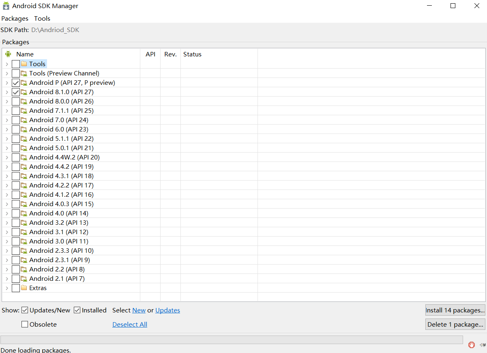
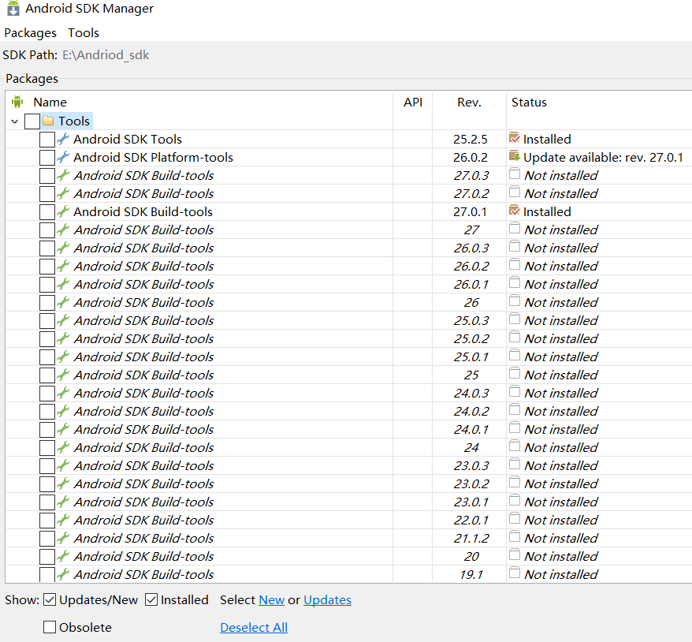
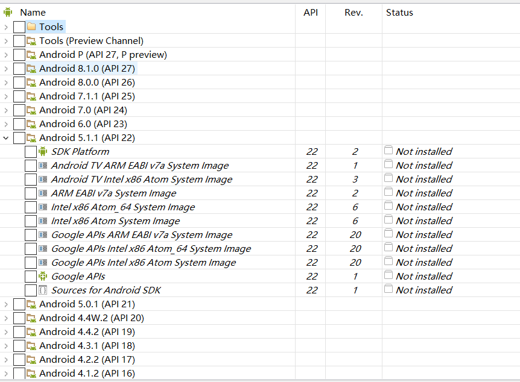
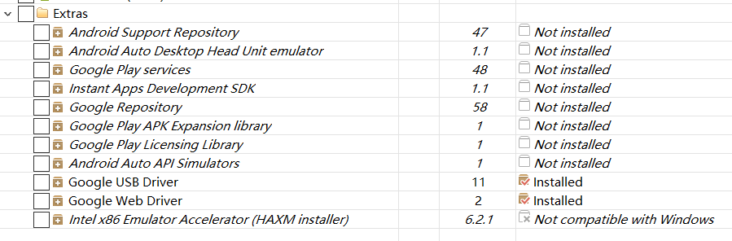
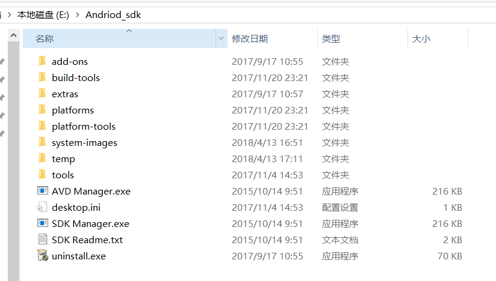
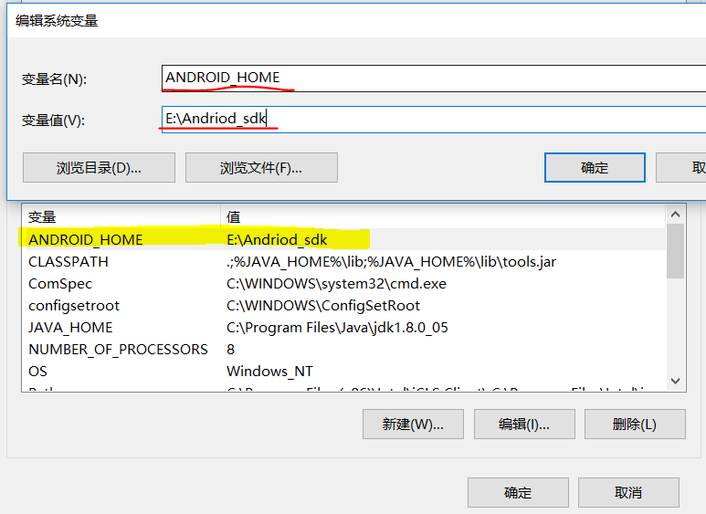
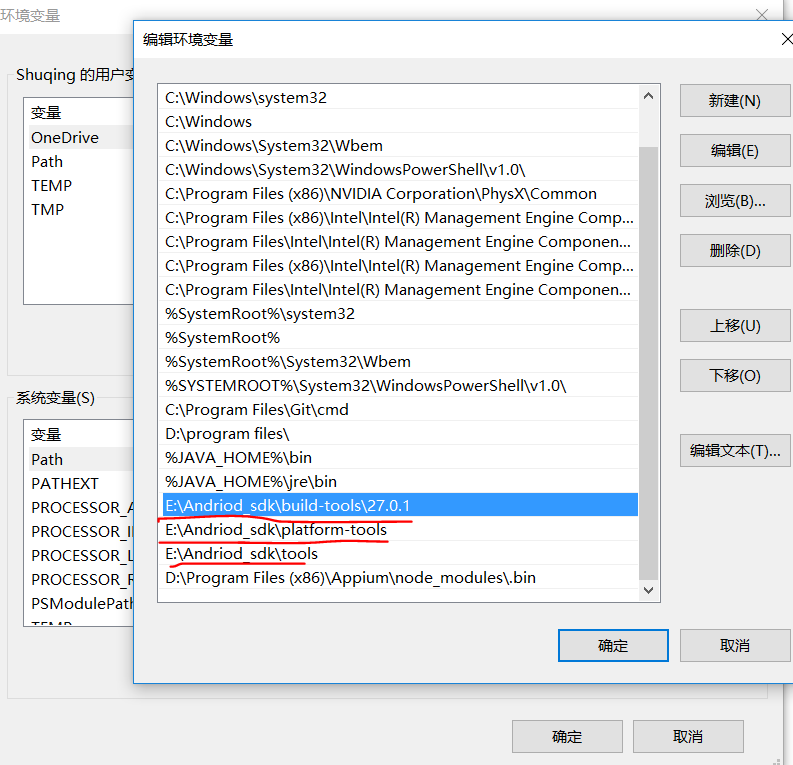

概念
----

SDK：（software development
kit）软件开发工具包。被软件开发工程师用于为特定的软件包、软件框架、硬件平台、操作系统等建立应用软件的开发工具的集合。

因此，Android SDK 指的是Android专属的软件开发工具包。 来源：百度百科

下载安装
--------

首先需要安装配置好<u>jdk环境</u>。

C:\\Users\\Shuqing\>java -version

java version \"1.8.0\_05\"

Java(TM) SE Runtime Environment (build 1.8.0\_05-b13)

Java HotSpot(TM) 64-Bit Server VM (build 25.5-b02, mixed mode)

Android SDK包下载

-   官网下载：[[https://android-sdk.en.softonic.com/download]{.underline}](https://android-sdk.en.softonic.com/download)

-   网盘下载： [[http://tools.android-studio.org/index.php/sdk]{.underline}](http://tools.android-studio.org/index.php/sdk)

Tips: 点击视频左下方获取素材，可以下载到对应的软件：Andriod\_sdk.exe。

下载对应的安装包后，点击安装即可。

Android SDK Manager
-------------------

安装后启动 **SDK Manager.exe** 程序就可以看到Android SDK
Mannerger的主界面。

{width="6.932468285214348in" height="5.025in"}

### Tools目录：

{width="6.63982283464567in" height="6.15in"}

**Android SDK
Tools**（必须，只需下载一个版本，一般选最新版本）：基础工具包，版本号带rc字样的是预览版。

**Android SDK
Platform-tools**（必须，只需下载一个版本，一般选最新版本）：从android2.3开始划出此目录，存放公用开发工具，比如adb、sqlite3等，被划分到了这里。

**Android SDK
Build-tools**（必须，可以安装多个版本）：Android项目构建工具。

**Android xxx（API xx）** 目录（可选的各平台开发工具）：

{width="6.391288276465442in" height="4.7in"}

-   Documentation for
    AndroidSdk（可选）：安卓开发者官网的一些离线文档，不过下载下来打开也很慢，后面会提供另外一个离线版。

-   **SDK
    Platform**（必须）：对应平台的开发工具，需要在哪个版本的平台下开发就下载哪个。

-   Samples for
    SDK（可选，此项在高版本tools中已不提供，需要在IDE里通过Import
    Sample引入，当然也可以下载离线版）：内置的安卓示例程序，推荐安装。

-   Sources for Android SDK（可选）：安卓API的源代码，推荐安装。

-   ARM /Intel xxxx
    Image（可选）：各个以Image结尾的东西是支持相应平台的模拟器，我们就把它想象成一个刷机包吧。（使用真机调试或使用其它模拟器的话不需要安装）

**Extras目录**（可选的扩展）：

{width="6.3in" height="2.0738429571303585in"}

-   Android Support Repository（可选）：主要是方便在gradle中使用Android
    Support Libraries，因为Google并没有把这些库发布到maven
    center或者jcenter去，而是使用了Google自己的maven仓库。

-   Intel x86 Emulator Accelerator(HAXM
    installer)（可选）：windows平台的Intel x86模拟器加速工具，配合Intel
    x86 atom/atom\_64 System Image使用可加快模拟器的运行速度。

-   

Tips：如果觉得一个个安装下载太麻烦，可以直接在视频下方【获取素材】获取已经下载打包好的Android\_SDK压缩包：Andriod\_SDK.zip，立等可取，开箱即用！

Android SDK文件目录
-------------------

{width="6.275in"
height="3.563956692913386in"}

#### add-ons

这里面保存着附加库，第三方公司为android
平台开发的附加功能系统。比如GoogleMaps，当然你如果安装了OphoneSDK，这里也会有一些类库在里面。

#### docs

这里面是Android SDKAPI参考文档，所有的API都可以在这里查到。

#### extras

该文件夹下存放了Android support v4，v7，v13，v17包；
还有google提供额USB驱动、Intel提供的硬件加速等附加工具包，
和market\_licensing作为AndroidMarket版权保护组件，一般发布付费应用到电子市场可以用它来反盗版。

#### platforms

是每个平台的SDK真正的文件，存放了不同版本的android系统。里面会根据APILevel划分的SDK版本。

#### samples

是Android SDK自带的默认示例工程，里面的apidemos强烈推荐初学者运行学
习，对于SQLite数据库操作可以查看NotePad这个例子，对于游戏开发Snake、LunarLander都是不错的例子，对于Android主
题开发Home则是androidm5时代的主题设计原理。

#### 环境变量设置

-   系统变量里面添加变量名 ANDROID\_HOME 路径为实际存放SDk的路径

{width="6.334800962379703in"
height="4.616666666666666in"}

-   其他几个路径配置到系统环境Path中如下图所示：

{width="6.262857611548556in"
height="6.041666666666667in"}

### 配置检测

在cmd界面输入"adb" 和\"appt\"来判断安装是否成功。

adb命令

C:\\Users\\Shuqing\>adb

Android Debug Bridge version 1.0.39

Revision 3db08f2c6889-android

Installed as E:\\Andriod\_sdk\\platform-tools\\adb.exe

global options:

-a listen **on** **all** network interfaces, **not** just localhost

-d **use** USB device (error **if** multiple devices connected)

-e **use** TCP/IP device (error **if** multiple TCP/IP devices
available)

-s SERIAL

**use** device **with** given serial number (overrides
\$ANDROID\_SERIAL)

-p PRODUCT

name **or** path (\'angler\'/\'out/target/product/angler\');

**default** \$ANDROID\_PRODUCT\_OUT

-H name **of** adb server host \[**default**=localhost\]

-P **port** **of** adb server \[**default**=5037\]

-L SOCKET listen **on** given socket **for** adb server
\[**default**=tcp:localhost:5037\]

aapt命令

C:\\Users\\Shuqing\>aapt

Android Asset Packaging Tool

Usage:

aapt l\[ist\] \[-v\] \[-a\] file.{zip,jar,apk}

List contents of Zip-compatible archive.

aapt d\[ump\] \[\--values\] \[\--include-meta-data\] WHAT file.{apk}
\[asset \[asset \...\]\]

strings Print the contents of the resource table string pool **in** the
APK.

badging Print the label **and** icon **for** the app declared **in**
APK.

permissions Print the permissions **from** the APK.

resources Print the resource table **from** the APK.

configurations Print the configurations **in** the APK.

xmltree Print the compiled xmls **in** the given assets.

xmlstrings Print the strings of the given compiled xml assets.

#### 参考资料：

-   [[http://www.cnblogs.com/kangjianwei101/p/5621238.html\#m2]{.underline}](http://www.cnblogs.com/kangjianwei101/p/5621238.html#m2)

-   [[http://blog.csdn.net/aiynmimi/article/details/51028499]{.underline}](http://blog.csdn.net/aiynmimi/article/details/51028499)
