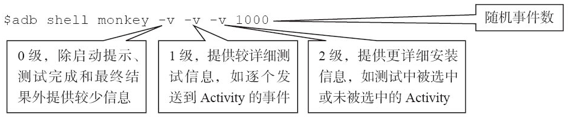
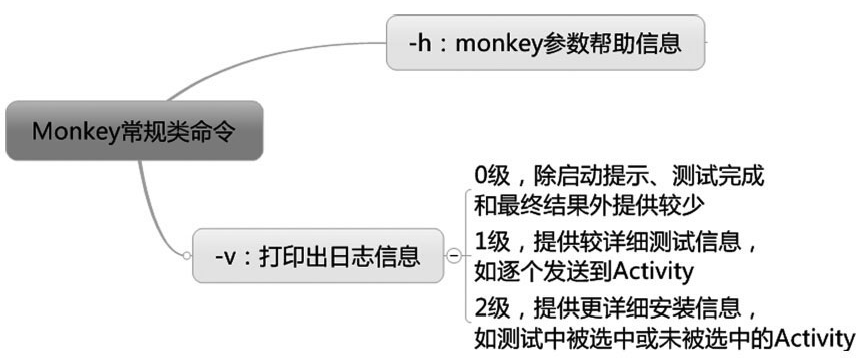
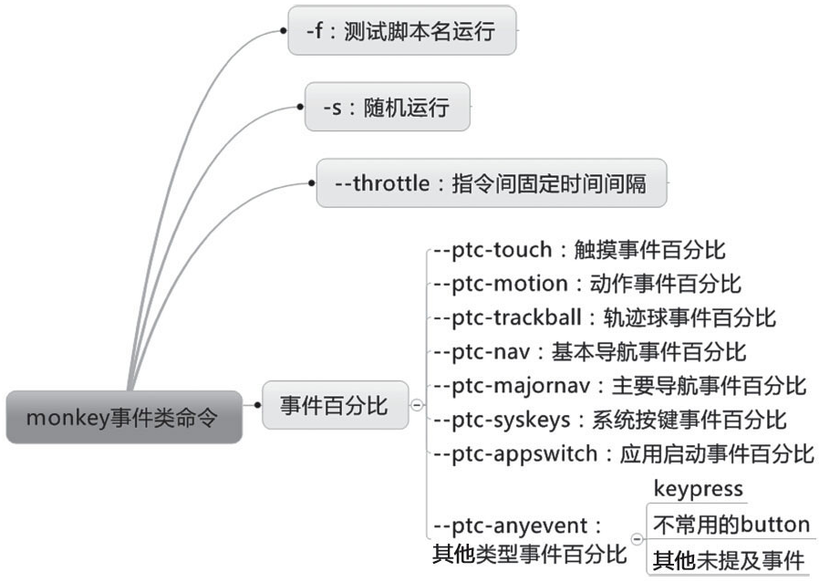
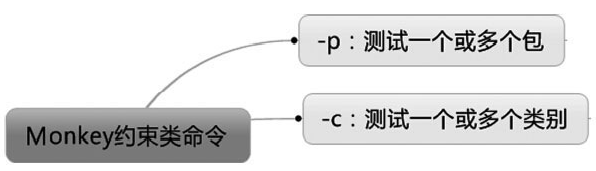
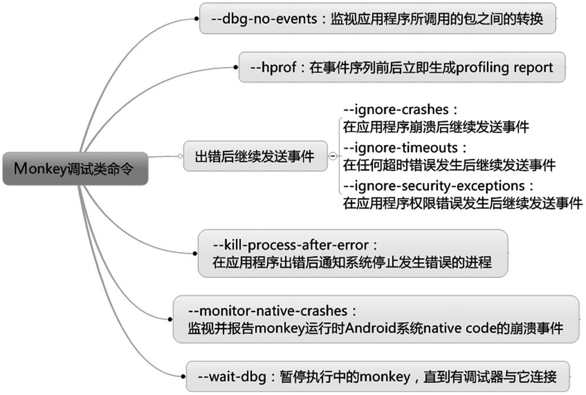

monkey 参数
-----------

### 参数分类

-   常规类参数

-   事件类参数

-   约束类参数

-   调试类参数

### 常规类参数

常规类参数包括帮助参数和日志信息参数。帮助参数用于输出Monkey命令使用指导；日志信息参数将日志分为三个级别，级别越高，日志的信息越详细。

1.帮助类参数

monkey -h

2.日志级别

\$ adb **shell** monkey -v \<event-count\>

-v：打印出日志信息，每个-v将增加反馈信息的级别。-v越多日志信息越详细，不过目前最多支持3个-v，即：

### 事件类参数

事件类参数的作用是对随机事件进行调控，从而使其遵照设定运行，如设置各种事件的百分比、设置事件生成所使用的种子值等。频率参数主要限制事件执行的时间间隔。

1.执行指定脚本

\$ adb **shell** monkey -f \<scriptfile\> \<event-count\>

eg：

\$ adb **shell** monkey -f /mnt/sdcard/test1

2.伪随机数生成种子值

使用
-s命令可以重复执行之前的伪随机操作。本身每次执行伪随机事件操作也会默认生成一个seed值

\$ adb **shell** monkey -s \<seed\> \<event-count\>

eg:

\$ adb **shell** monkey -s 666 100

3.设置间隔
如果你希望在每一个指令之间加上固定的间隔时间，可以用\--throttle（注意，前面是\--）命令。

\$ adb **shell** monkey \--throttle \<milliseconds\>

eg:

\$ adb **shell** monkey \--throttle 3000 5

\--throttle：后面接时间，单位为ms（\<milliseconds\>），表示事件之间的固定延迟（即执行每一个指令间隔的时间），若不接该选项，monkey将不会延迟。

4.调整触摸事件百分比

如果你希望调整触摸事件的百分比，记住使用\--pct-touch。

\$ adb **shell** monkey \--pct-touch

eg:

\$ adb **shell** monkey -v -v \--pct-touch 100 200

\<percent\>\--pct-touch：后面接触摸事件百分比

注意：触摸事件不单单是按键，它泛指发生在某一位置的一个down-up事件。

5.调整手势事件百分比

\$ adb **shell** monkey \--pct-motion

eg:

\$ adb **shell** monkey -v -v \--pct-motion 100 200

6.调整应用启动事件的百分比

如果你希望调整应用启动事件的百分比，记住使用\--pct-app-switch。

\$ adb **shell** monkey \--pct-appswtich \<percent\>

\--pct-appswitch：后面接应用启动事件百分比。

应用启动事件（即activity
launches）俗称打开应用，通过调用startActivity()方法最大限度地开启该package下的所有应用。

7.调整屏幕旋转事件百分比

\$ adb **shell** monkey \--pct-rotation \<percent\>

\--pct-rotation 后面接屏幕旋转事件的比例值。

8.其他参数

{width="6.68573709536308in" height="4.75in"}

### 约束类参数

**1.包约束**

-p：后面接一个或多个包名（\<allowed-package-name\>），如果应用需要访问其他包里的Activity，那相关的包也需要在此同时指定。如果不指定任何包，monkey将允许系统启动全部包里的Activity。

\$ adb shell monkey -**p** \<allowed-package-name\> \<event-count\>

eg：

\$ adb shell monkey -**p** com.tal.kaoyan 500

\$ adb shell monkey -**p** com.tal.kaoyan -**p** com.tencent.mm 500

**2.activity类约束**

如果你希望将monkey限制在一个或几个类别中，使用如下命令：

adb **shell** monkey -c \<main-category\> \<event-count\>

以下命令表示运行Intent.CATEGORY\_LAUNCHER类别的Activity并发送1000个随机事件。

\$ adb **shell** monkey -c Intent.CATEGORY\_LAUNCHER 1000

### 调试类参数

**1.应用程序崩溃后继续发送事件**

如果你希望monkey在应用程序崩溃后继续发送事件，则需要用到\--ignore-crashes命令

\$ adb **shell** monkey \--ignore-crashes \<event-count\>

在设置此选项后，当应用程序崩溃或发生失控异常时，monkey将继续运行直到计数完成。如果不设置此选项，monkey遇到上述崩溃或异常将停止运行。

**2.超时错误继续发送事件**

如果你希望monkey在任何超时错误发生后继续发送事件，则需要用到\--ignore-timeouts命令。

\$ adb **shell** monkey \--ignore-timeouts

\<event-count\>\--ignore-timeouts：在设置此选项后，当应用程序发生任何超时错误（如ANR，即Application
Not
Responding）时，monkey将继续运行直到计数完成。如果不设置此选项，monkey遇到此类超时对话框将停止运行。

**3.应用程序权限错误发生后继续发送事件**

如果你希望monkey在应用程序权限错误发生后继续发送事件，则需要用到\--ignore-security-exceptions命令。

\$ adb **shell** monkey \--ignore-security-exceptions

\<event-count\>\--ignore-security-exceptions：在设置此选项后，当应用程序发生任何权限错误（如启动一个需要某些权限的Activity）时，monkey将继续运行直到计数完成。如果不设置此选项，monkey遇到此类权限错误将停止运行。

4.其他

Monkey参数应用综合案例
----------------------

##### 测试场景

测试考研帮app
Android版。测试希望通过Monkey来模拟用户的随机操作，检查被测应用是否会出现异常（应用崩溃或者无响应）。

##### 需求分析

1、测试是指定应用，因此需要使用-p指定被测app包名：com.tal.kaoyan

2、这个测试的目的是希望模拟用户操作，因此需要让Monkey执行的事件尽可能地接近用户的常规操作，这样才可以最大限度地发现用户使用过程中可能出现的问题。因此需要对Monkey执行的事件百分比做一些调整:

触摸事件和手势事件是用户最常见的操作，所以通过\--pct-touch和\--pct-motion将这两个事件的占比调整到40%与25%；目标应用包含了多个Activity，为了能覆盖大部分的Activity，所以通过\--pct-appswitch将Activity切换的事件占比调整到10%；被测应用在测试中出现过不少横竖屏之间切换的问题，这个场景也必须关注，因此通过\--pct-rotation把横竖屏切换事件调整到10%。

3、使用-s参数来指定命令执行的seed值
Monkey会根据seed值来生成对应事件流，同一个seed生成的事件流是完全相同的。这里指定了seed值，是为了测试发现问题时，便于进行问题复现。

4、使用\--throttle参数来控制Monkey每个操作之间的时间间隔
指定操作之间的时间间隔，一方面是希望能更接近用户的操作场景，正常用户操作都会有一定的时间间隔；另一方面也是不希望因为过于频繁的操作而导致系统崩溃，尤其是在比较低端的手机上执行测试时。因此通过\--throttle设置Monkey每个操作固定延迟0.4秒。

5、使用\--ignore-crashs和\--ignore-timeouts参数使Monkey遇到意外时能继续执行
在执行Monkey测试时，会因为应用的崩溃或没有响应而意外终止，所以需要在命令中增加限制参数\--ignore-crash和\--ignore-timeouts，让Monkey在遇到崩溃或没有响应的时候，能在日志中记录相关信息，并继续执行后续的测试。

6、使用-v指定log的详细级别
Monkey的日志输出有3个级别：日志的级别越高，其详细程度也越高。为了方便问题的定位，这里将日志设为
-v -v.

##### 测试命令

adb shell monkey -p com.tal.kaoyan

\--pct-touch 40 \--pct-motion 25

\--pct-appswitch 10

\--pct-rotation 5

-s 1666 \--throttle 400

\--ignore-crashes

\--ignore-timeouts

-v -v 200
