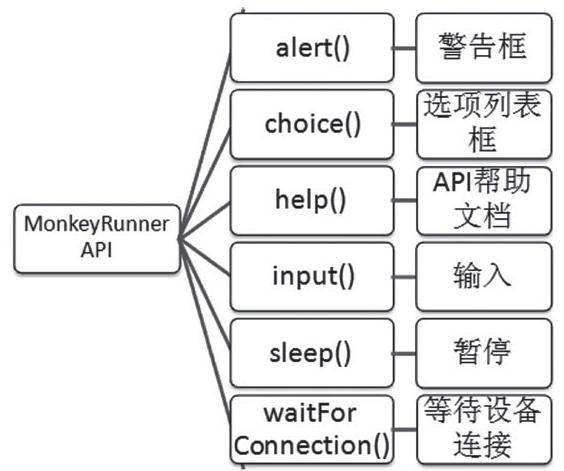
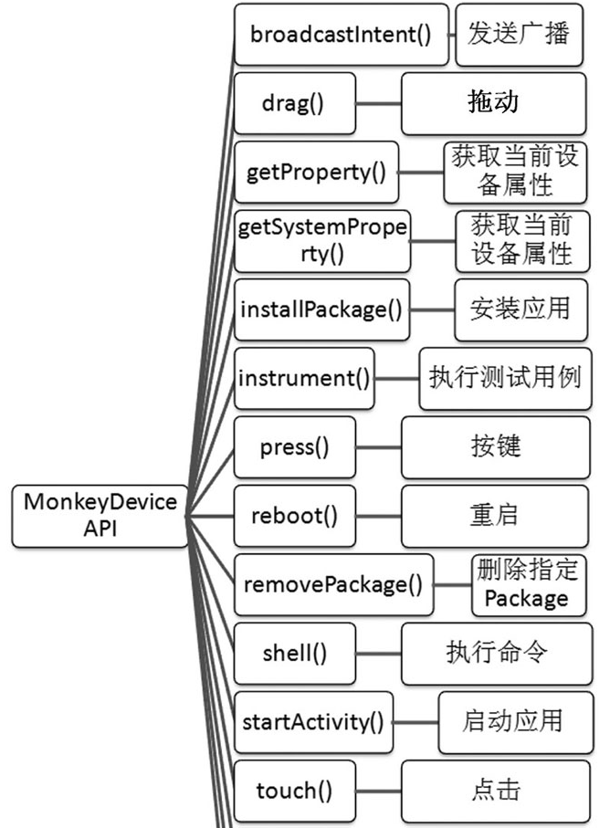
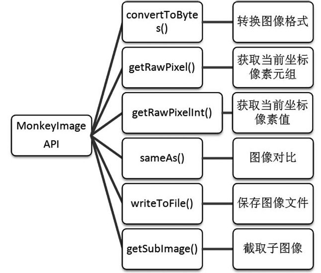

MonkeyRunner API
----------------

MonkeyRunner工具主要有三个类：

1.  MonkeyRunner

2.  MonkeyDevice

3.  MonkeyImage

官方API文档
：[[http://www.android-doc.com/tools/help/monkeyrunner\_concepts.html\#]{.underline}](http://www.android-doc.com/tools/help/monkeyrunner_concepts.html)

### 1.MonkeyRunner类：

MonkeyRunner提供连接真机和模拟器、输入、暂停、警告框等方法。

##### 常用方法

waitForConnection(float timeout,string deviceid)，

**from** com.android.monkeyrunner import MonkeyRunner as mr

print(\"connect devices\...\")

device=mr.waitForConnection()

*\# device=mr.waitForConnection(5,\'127.0.0.1:62001\')*

### 2.MonkeyDevice类

MonkeyDevice类提供了安装和卸载程序包、开启Activity、发送按键和点击事件、运行测试包等方法。

#### 常用方法

-   installPackage (string path)

-   removePackage (string package)

-   startActivity (string uri, string action, string data, string
    mimetype, iterable categories dictionary extras, component
    component, flags)

-   touch (integer x, integer y, integer type)

**touch参数说明**

integer x，x坐标值。\
integer y，y坐标值。\
integer type，key event类型（如DOWN、UP、DOWN\_AND\_UP）。

DOWN为按下事件 UP为弹起事件 DOWN\_AND\_UP为按下弹起事件。

-   drag (tuple start, tuple end, float duration, integer steps)

**drag参数详细说明如下：**

tuple start，拖拽起始位置，为tuple类型的(x,y)坐标点。\
tuple end，拖拽终点位置，为tuple类型的(x,y)坐标点。\
float duration，拖拽手势持续时间，默认为1.0s。\
-integer steps，插值点的步数，默认值为10。

##### 实践案例：

连接设备，安装考研帮App并启动

##### 代码实现

kyb\_start.py

**from** com.android.monkeyrunner **import** MonkeyRunner **as** mr

**from** com.android.monkeyrunner **import** MonkeyDevice **as** md

print(\"connect devices\...\")

device=mr.waitForConnection()

print(\"install app\...\")

device.installPackage(r\'C:\\Users\\Shuqing\\Desktop\\kaoyan3.1.0.apk\')

package = \'com.tal.kaoyan\'

activity = \'com.tal.kaoyan.ui.activity.SplashActivity\'

runComponent = package + \'/\' + activity

print(\"launch App\...\")

device.startActivity(component=runComponent)

代码执行方式

monkeyrunner scripfile

C:\\Users\\Shuqing\>monkeyrunner E:\\monkeyrunner\_script\\kyb.py

### 

### 

### 3.MonkeyImage类

MonkeyImage类在测试过程中用来保存各种格式的测试截图，并可以进行图像对比。

#### 常用方法

-   takeSnapshot() 进行屏幕截图

-   writeToFile() 保存图像文件到指定的文件路径

#### 用法示例

**from** com.android.monkeyrunner **import** MonkeyImage **as** mi

print(\"takeSnapshot\")

screenshot=device.takeSnapshot()

screenshot.writeToFile(r\'E:\\monkeyrunner\_script\\test.png\',\'png\')

综合实践
--------

#### 测试场景

-   连接设备，自动安装并启动考研帮app

-   启动后登录账号（账号zxw1234
    密码：zxw123456），然后截图并保存到指定文件位置。

#### 思路分析

-   连接设备

-   安装app

-   启动app

-   输入用户名密码点击登录按钮

-   截图

-   

#### 脚本实现

kyb\_login.py

**from** com.android.monkeyrunner **import** MonkeyRunner **as** mr

**from** com.android.monkeyrunner **import** MonkeyDevice **as** md

**from** com.android.monkeyrunner **import** MonkeyImage **as** mi

print(\"connect devices\...\")

device=mr.waitForConnection()

print(\" install app\")

device.installPackage(r\'C:\\Users\\Shuqing\\Desktop\\kaoyan3.1.0.apk\')

print(\"launch app\...\")

package=\'com.tal.kaoyan\'

activity=\'com.tal.kaoyan.ui.activity.SplashActivity\'

runComponent=package+\'/\'+activity

device.startActivity(component=runComponent)

mr.sleep(3)

print(\"touch cancel button\")

device.touch(618,895,\'DOWN\_AND\_UP\')

mr.sleep(1)

print(\"touch skip button\")

device.touch(804,67,\'DOWN\_AND\_UP\')

mr.sleep(1)

print(\"input username and password\")

device.touch(57,373,\'DOWN\_AND\_UP\')

mr.sleep(2)

device.type(\'zxw1234\')

device.touch(152,480,\'DOWN\_AND\_UP\')

mr.sleep(2)

device.type(\'zxw123456\')

mr.sleep(2)

print(\"touch login button\")

device.touch(331,634,\'DOWN\_AND\_UP\')

print(\"takeSnapshot\")

screenshot=device.takeSnapshot()

screenshot.writeToFile(r\'D:\\monkeyrunner\\kyb.png\',\'png\')

### 注意事项

方法调用错误

AttributeError: type object \'com.android.monkeyrunner.XXXXX\' has
**no** attribute XXXXXX

检查调用的方法名是否写错，特别是注意区分大小写。

字符编码错误

SyntaxError: Non-ASCII character **in** file
\'E:\\monkeyrunner\_script\\kyb.py\', **but** no encoding declared;

需要在代码顶部补充 \# -*- coding: utf-8 -*- 或者去掉代码中的中文字符
