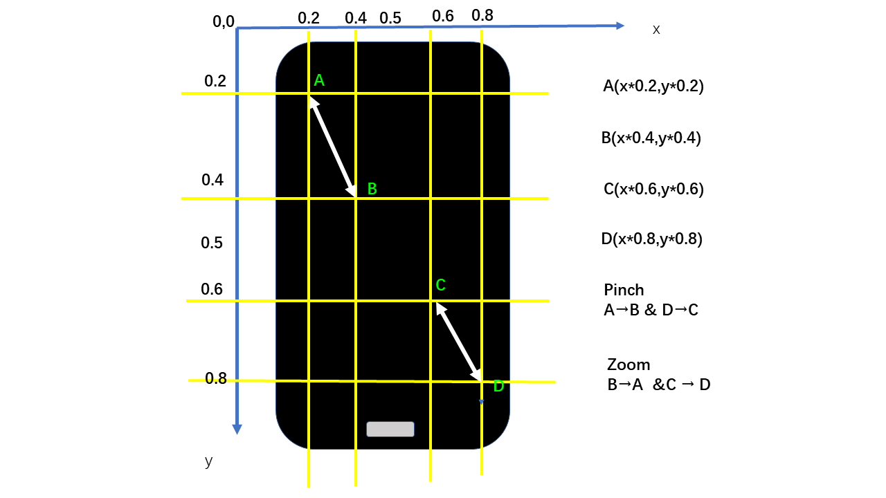

问题思考
--------

在使用地图App中，我们经常需要对界面进行缩放操作来更加便利的查看位置。那么在Appium中怎样去模拟这类操作呢？

MultiAction
-----------

MultiAction
是多点触控的类，可以模拟用户多点操作。主要包含 **add()** 和 **perform()** 两个方法，
MultiAction可以结合前面所学的 **ActionTouch**可以模拟出用户的多个手指滑动的操作效果；

from appium.webdriver.common.multi\_action import MultiAction

from appium.webdriver.common.touch\_action import TouchAction

### 加载：

方法add(self,
\*touch\_actions)将TouchAction对象添加到MultiAction中，稍后再执行。

##### 参数：

-   touch\_actions -
    一个或多个TouchAction对象，描述一个手指要执行的动作链

##### 用法

a1 = TouchAction(driver)

a1.press(el1).**move\_to(el2).release()**

a2 = TouchAction(driver)

a2.press(el2).**move\_to(el1).release()**

**MultiAction(driver).add(a1,** a2)

### 执行

perform(self) 执行存储在对象中的操作。

##### 用法

a1 = TouchAction(driver)

a1.press(el1).**move\_to(el2).release()**

a2 = TouchAction(driver)

a2.press(el2).**move\_to(el1).release()**

**MultiAction(driver).add(a1,** a2).perform()

Ps：是不是有点类似Python里面的多线程和多进程的使用。

多点触控操作实践------地图App缩放
---------------------------------

#### 测试场景

安装启动百度地图Android app 进入地图后分别进行放大缩小操作

#### 测试环境

-   Appium 1.7.2

-   Win10 64bit

-   夜神模拟器 Android5.1.1

-   百度地图Android版 V10.6.5

#### 滑动原理图解

#### 代码实现

multi\_action.py

**from** appium **import** webdriver

**from** time **import** sleep

**from** appium.webdriver.common.touch\_action **import** TouchAction

**from** appium.webdriver.common.multi\_action **import** MultiAction

desired\_caps={}

desired\_caps\[\'platformName\'\]=\'Android\'

desired\_caps\[\'deviceName\'\]=\'127.0.0.1:62025\'

desired\_caps\[\'platforVersion\'\]=\'5.1.1\'

desired\_caps\[\'app\'\]=r\'C:\\Users\\Shuqing\\Desktop\\com.baidu.BaiduMap.apk\'

desired\_caps\[\'appPackage\'\]=\'com.baidu.BaiduMap\'

desired\_caps\[\'appActivity\'\]=\'com.baidu.baidumaps.WelcomeScreen\'

driver=webdriver.Remote(\'http://localhost:4723/wd/hub\',desired\_caps)

driver.implicitly\_wait(5)

driver.find\_element\_by\_id(\'com.baidu.BaiduMap:id/dj2\').click()

driver.find\_element\_by\_id(\'com.baidu.BaiduMap:id/byo\').click()

x=driver.get\_window\_size()\[\'width\'\]

y=driver.get\_window\_size()\[\'height\'\]

**def** **pinch**():

action1=TouchAction(driver)

action2=TouchAction(driver)

zoom\_action=MultiAction(driver)

action1.press(x=x\*0.2,y=y\*0.2).wait(1000).move\_to(x=x\*0.4,y=y\*0.4).wait(1000).release()

action2.press(x=x\*0.8,y=y\*0.8).wait(1000).move\_to(x=x\*0.6,y=y\*0.6).wait(1000).release()

print(\'start pinch\...\')

zoom\_action.add(action1,action2)

zoom\_action.perform()

**def** **zoom**():

action1=TouchAction(driver)

action2=TouchAction(driver)

zoom\_action=MultiAction(driver)

action1.press(x=x\*0.4,y=y\*0.4).wait(1000).move\_to(x=x\*0.2,y=y\*0.2).wait(1000).release()

action2.press(x=x\*0.6,y=y\*0.6).wait(1000).move\_to(x=x\*0.8,y=y\*0.8).wait(1000).release()

print(\'start zoom\...\')

zoom\_action.add(action1,action2)

zoom\_action.perform()

**if** \_\_name\_\_ == \'\_\_main\_\_\':

**for** i **in** range(3):

pinch()

**for** i **in** range(3):

zoom()

参考资料
--------

[[http://appium.io/docs/cn/writing-running-appium/touch-actions/]{.underline}](http://appium.io/docs/cn/writing-running-appium/touch-actions/)

[[https://stackoverflow.com/questions/38565116/zoom-action-in-android-using-appium-python-client]{.underline}](https://stackoverflow.com/questions/38565116/zoom-action-in-android-using-appium-python-client)
